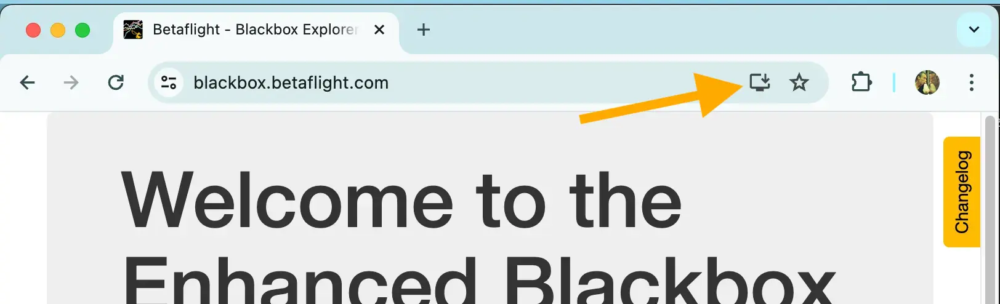
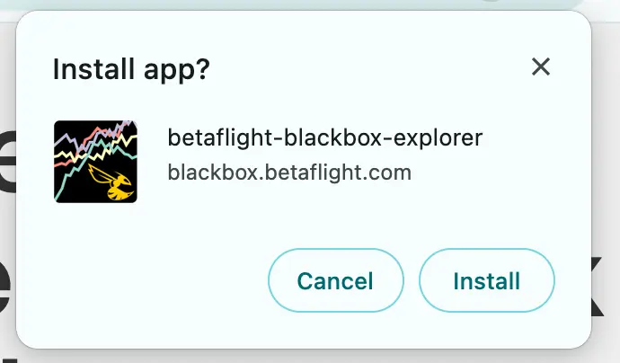

# Betaflight Blackbox Explorer

[](https://github.com/betaflight/blackbox-log-viewer/releases)
[](https://sonarcloud.io/dashboard?id=betaflight_blackbox-log-viewer)
[](https://www.gnu.org/licenses/gpl-3.0)


This tool allows you to open logs recorded by Betaflight's Blackbox feature in
your web browser. You can seek through the log to examine graphed values at each
timestep. If you have a flight video, you can load that in as well and it'll be
played behind the log. You can export the graphs as a WebM video to share with
others.

## Installation

Current blackbox explorer version is built as
[PWA](https://developer.mozilla.org/en-US/docs/Web/Progressive_web_apps/Guides/What_is_a_progressive_web_app).
Meaning it can work in both online and offline modes as regular desktop app
would.

### Web

1. Visit https://blackbox.betaflight.com/
2. Use the app

### Standalone

1. Visit https://blackbox.betaflight.com/
2. Follow the procedure to install PWA on your platform. On MacOS chrome:



## Usage

Click the "Open log file/video" button at the top right and select your log file
and your flight video (if you recorded one).

You can scroll through the log by clicking or dragging on the seek bar that
appears underneath the main graph. The current time is represented by the
vertical red bar in the center of the graph. You can also click and drag left
and right on the graph area to scrub backwards and forwards.

### Syncing your log to your flight video

The blackbox plays a short beep on the buzzer when arming, and this corresponds
with the start of the logged data.  You can sync your log against your flight
video by pressing the "start log here" button when you hear the beep in the
video. You can tune the alignment of the log manually by pressing the nudge left
and nudge right buttons in the log sync section, or by editing the value in the
"log sync" box. Positive values move the log toward the end of the video,
negative values move it towards the beginning.

### Customizing the graph display

Click the "Graph Setup" button on the right side of the display in order to
choose which fields should be plotted on the graph. You may, for example, want
to remove the default gyro plot and add separate gyro plots for each rotation
axis.  Or you may want to plot vbat against throttle to examine your battery's
performance.

## Developing

### Node setup

We are using [nvm](https://github.com/nvm-sh/nvm) to manage the correct node
vesion, follow the install instruction there. After which from blackbox directory
just run:

```bash
nvm use
```

### Yarn

For dependency management we are using [yarn](https://yarnpkg.com/), follow the
instruction there to install it.

### Development mode

We are using [vite](https://vitejs.dev/) for development setup. It provides
bundling and various optimisations like hot module reloading.

With `node` and `yarn` setup, to start developing run:

```bash
yarn start
```

This will start development server on http://localhost:5173/.

## Installing Dev Build locally

If you want to have latest and greatest version installed on your machine from
the tip of the repository:
1. First need to build the application:
```bash
yarn build
```
2. Start the application in `preview` mode
```bash
yarn preview
```
3. Visit http://localhost:4173/
4. Follow the steps from [Standalone](#standalone)

## Flight video won't load, or jumpy flight video upon export

Some flight video formats aren't supported by Chrome, so the viewer can't open
them. You can fix this by re-encoding your video using the free tool
[Handbrake][]. Open your original video using Handbrake. In the output settings,
choose MP4 as the format, and H.264 as the video codec.

Because of [Google Bug #66631][], Chrome is unable to accurately seek within
H.264 videos that use B-frames. This is mostly fine when viewing the flight
video inside Blackbox Explorer. However, if you use the "export video" feature,
this bug will cause the flight video in the background of the exported video to
occasionally jump backwards in time for a couple of frames, causing a very
glitchy appearance.

To fix that issue, you need to tell Handbrake to render every frame as an
intraframe, which will avoid any problematic B-frames. Do that by adding
"keyint=1" into the Additional Options box:


Hit start to begin re-encoding your video. Once it finishes, you should be able
to load the new video into the Blackbox Explorer.

[Handbrake]: https://handbrake.fr/
[Google Bug #66631]: http://code.google.com/p/chromium/issues/detail?id=66631

## License

This project is licensed under GPLv3.
