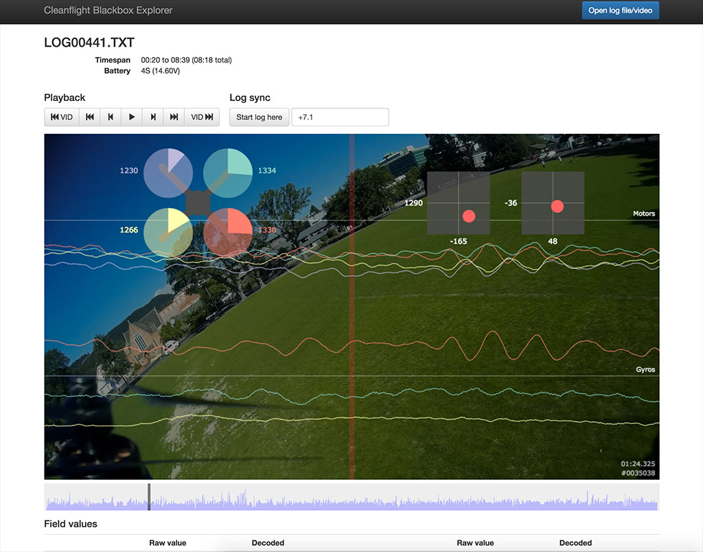
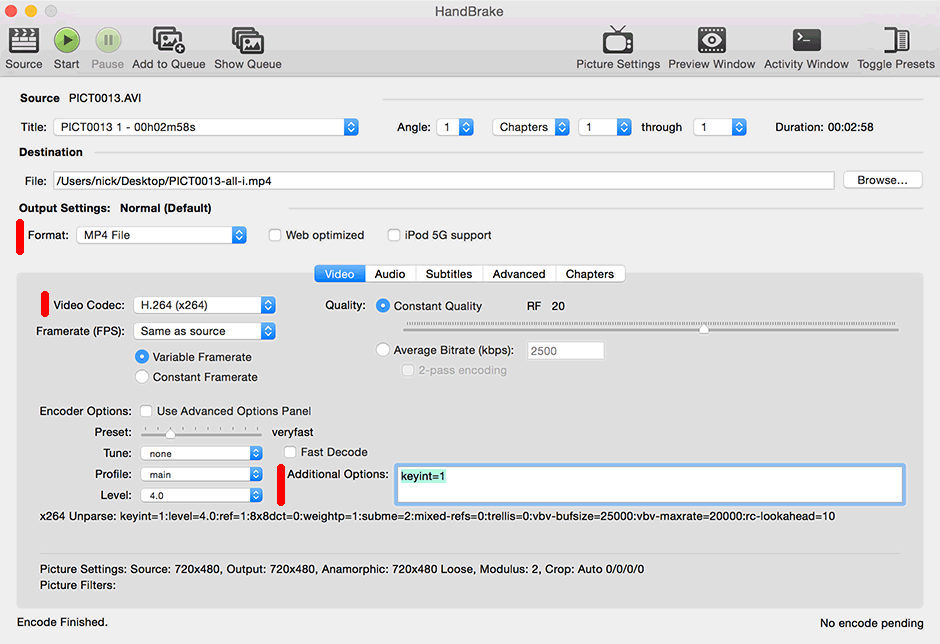

# Betaflight Blackbox Explorer

[](https://github.com/betaflight/blackbox-log-viewer/releases) [](https://travis-ci.com/betaflight/blackbox-log-viewer) [](https://sonarcloud.io/dashboard?id=betaflight_blackbox-log-viewer) [](https://dev.azure.com/Betaflight/Betaflight%20Nightlies/_build/latest?definitionId=2&branchName=master) [](https://www.gnu.org/licenses/gpl-3.0)



This tool allows you to open logs recorded by Betaflight's Blackbox feature in your web browser. You can seek through
the log to examine graphed values at each timestep. If you have a flight video, you can load that in as well and it'll
be played behind the log. You can export the graphs as a WebM video to share with others.

## Installation

### Standalone

Download the installer from [Releases](https://github.com/betaflight/blackbox-log-viewer/releases).

### Notes

#### Windows users

The minimum required version of Windows is Windows 8.

#### MacOS X users

Changes to the security model used in the latest versions of MacOS X 10.14 (Mojave) and 10.15 (Catalina) mean that the operating system will show an error message ('"Betaflight\ Blackbox\ Explorer.app" is damaged and can’t be opened. You should move it to the Trash.') when trying to install the application. To work around this, run the following command in a terminal before installing: `sudo xattr -rd com.apple.quarantine /Applications/Betaflight\ Blackbox\ Explorer.app`.

### Unstable Testing Versions

Unstable testing versions of the lates builds of the Betaflight Blackbox Explorer for most platforms can be downloaded from [here](https://github.com/betaflight/blackbox-log-viewer-nightlies/releases).

**Be aware that these versions are intended for testing / feedback only, and may be buggy or broken.**

## Usage
Click the "Open log file/video" button at the top right and select your log file and your flight video (if you recorded one).

You can scroll through the log by clicking or dragging on the seek bar that appears underneath the main graph. The 
current time is represented by the vertical red bar in the center of the graph. You can also click and drag left and
right on the graph area to scrub backwards and forwards.

### Syncing your log to your flight video

The blackbox plays a short beep on the buzzer when arming, and this corresponds with the start of the logged data.
You can sync your log against your flight video by pressing the "start log here" button when you hear the beep in the
video. You can tune the alignment of the log manually by pressing the nudge left and nudge right buttons in the log
sync section, or by editing the value in the "log sync" box. Positive values move the log toward the end of the video, 
negative values move it towards the beginning.

### Customizing the graph display

Click the "Graph Setup" button on the right side of the display in order to choose which fields should be plotted on
the graph. You may, for example, want to remove the default gyro plot and add separate gyro plots for each rotation axis.
Or you may want to plot vbat against throttle to examine your battery's performance.

## Native app build via NW.js

### Development

1. Install node.js
2. Install yarn: `npm install yarn -g`.
3. Change to project folder and run `yarn install`.
4. Run `yarn start` to build & run the debug flavor.

### App build and release

The tasks are defined in `gulpfile.js` and can be run through yarn:
```
yarn gulp <taskname> [[platform] [platform] ...]
```

List of possible values of `<task-name>`:
* **dist** copies all the JS and CSS files in the `./dist` folder.
* **apps** builds the apps in the `./apps` folder [1].
* **debug** builds debug version of the apps in the `./debug` folder [1].
* **release** zips up the apps into individual archives in the `./release` folder [1]. 

[1] Running this task on macOS or Linux requires Wine, since it's needed to set the icon for the Windows app (build for specific platform to avoid errors).

#### Setting up and building on a Mac

- Install GitHub desktop application from https://desktop.github.com and open the GitHub Desktop application.
- At https://github.com/betaflight/betaflight-configurator, select Clone or Download > Open in Desktop

(The GitHub Desktop application should come to the front and create a repository (not necessarily where you want it).  The blackbox-log-viewer repository (folder) should appear under the list of local repositories.  You can find your local repository location on your mac using the 'Locate in Finder' command GitHub Desktop  It can be moved somewhere more else, but you'll then need to tell Github where you're moved it to.)

Open Terminal.app and install or update homebrew:
```
/usr/bin/ruby -e "$(curl -fsSL https://raw.githubusercontent.com/Homebrew/install/master/install)"
```
install node 8.x and yarn, if already installed, agree to update them
```
brew install node@8 yarn
```
Change Terminal's working directory wherever you put blackbox-log-viewer folder; easiest way is to type 'cd ' in Terminal then drag the blackbox-log-viewer folder from the Finder to the terminal window.  Or use a terminal command like 
```
cd ~/mydirectorypath/blackbox-log-viewer
```

install dependencies into that folder (ignoring many confusing messages) with:
```
yarn install
```

finally build the DMG itself, which will end up in blackbox-log-viewer/release/, with:
```
yarn gulp release
```

#### Build or release app for one specific platform
To build or release only for one specific platform you can append the plaform after the `task-name`.
If no platform is provided, only for the platform you are builing from will be build.

* **MacOS X** use `yarn gulp <task-name> --osx64`
* **Linux** use `yarn gulp <task-name> --linux64`
* **Windows** use `yarn gulp <task-name> --win64`

You can also use multiple platforms e.g. `yarn gulp <taskname> --osx64 --linux64`. Other platforms like `--win32` and `--linux32` can be used too, but they are not officially supported, so use them at your own risk.

#### macOS DMG installation background image

The release distribution for macOS uses a DMG file to install the application.
The PSD source for the DMG backgound image can be found in the root (`dmg-background.png`). After changing the source, export the image to PNG format in folder `./images/`.

## Flight video won't load, or jumpy flight video upon export

Some flight video formats aren't supported by Chrome, so the viewer can't open them. You can fix this by re-encoding
your video using the free tool [Handbrake][]. Open your original video using Handbrake. In the output settings, choose
MP4 as the format, and H.264 as the video codec.

Because of [Google Bug #66631][], Chrome is unable to accurately seek within H.264 videos that use B-frames. This is
mostly fine when viewing the flight video inside Blackbox Explorer. However, if you use the "export video" feature, this
bug will cause the flight video in the background of the exported video to occasionally jump backwards in time for a
couple of frames, causing a very glitchy appearance.

To fix that issue, you need to tell Handbrake to render every frame as an intraframe, which will avoid any problematic
B-frames. Do that by adding "keyint=1" into the Additional Options box:



Hit start to begin re-encoding your video. Once it finishes, you should be able to load the new video into the Blackbox
Explorer.

[Handbrake]: https://handbrake.fr/
[Google Bug #66631]: http://code.google.com/p/chromium/issues/detail?id=66631

## License

This project is licensed under GPLv3.
